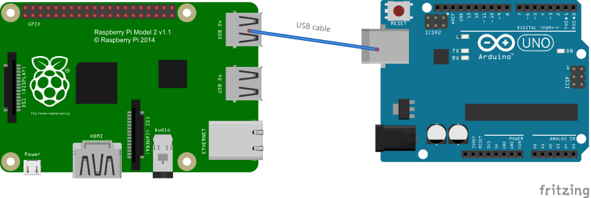
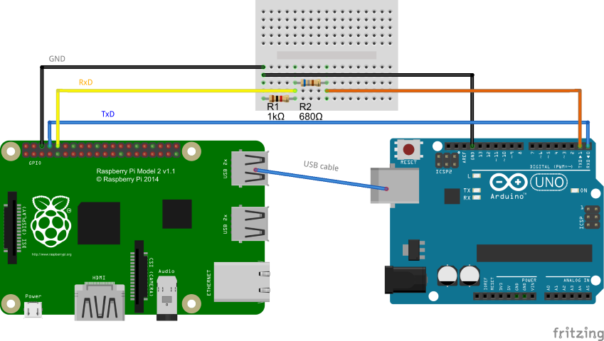
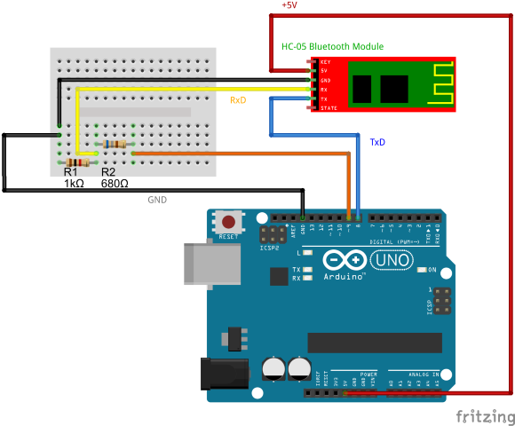
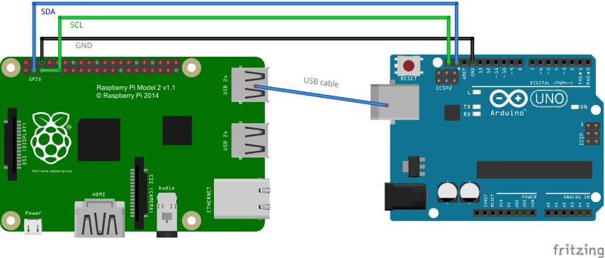
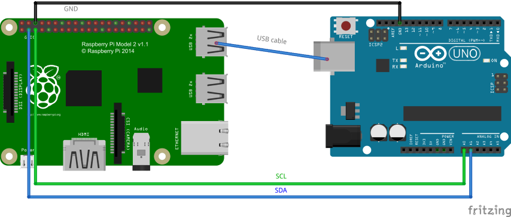
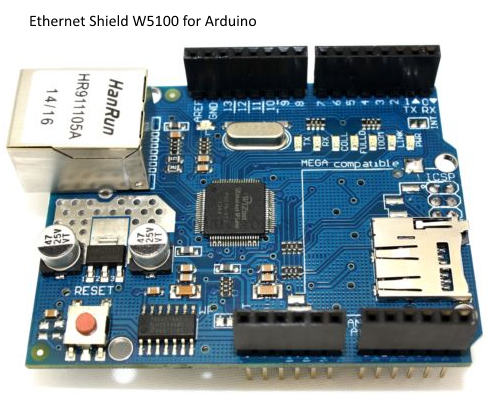
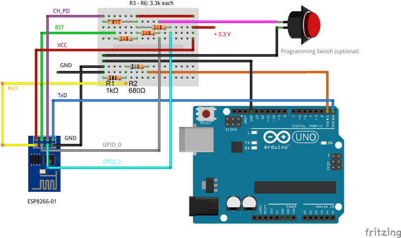
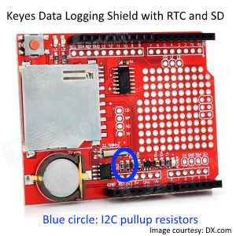

A selection of possible Arducom setups
======================================

Connecting using a USB cable
----------------------------

The simplest setup would be:

Of course, you can also use a normal PC or laptop instead of a Raspberry Pi.

This setup is recommended for getting started. The hello-world test sketch works with this setup by default.
The serial device on the Raspberry Pi would be something like /dev/ttyUSB0 or /dev/ttyACM0.

Direct serial connection
------------------------

Note that for other serial ports, such as those of PCs, you need a voltage level converter.

On a Raspberry Pi with Raspbian, this serial port is the device /dev/ttyAMA0. Depending on your configuration
you will have to prevent the system from occupying this port at startup.
For an example how to do this see here: https://www.raspberrypi.org/forums/viewtopic.php?f=44&t=15683

The hello-world test sketch works with this setup by default.

Serial Bluetooth connection
---------------------------

This example shows how to connect a serial Bluetooth module of type HC-05.
If you use a different one, please check that you use the correct voltages on your module's pins.

This example uses software serial port emulation on the Arduino. The default baud rate of the HC-05 is
9600 baud which is quite slow but works for a test. If you change the baud rate be aware that software
serial stops working well from 115200 baud onwards on 16 MHz devices; possibly less on slower ones.

To enable software serial in the hello-world sketch, follow these steps:

1. Disable hardware serial support:

		// #define SERIAL_STREAM                Serial
		// #define SERIAL_BAUDRATE              57600

2. Enable software serial support:

		#define SOFTSERIAL_RX_PIN       8
		#define SOFTSERIAL_TX_PIN       9
		SoftwareSerial softSerial(SOFTSERIAL_RX_PIN, SOFTSERIAL_TX_PIN);
		#define SERIAL_STREAM           softSerial
		#define SERIAL_BAUDRATE         9600
	
Getting a Linux machine to connect to the HC-05 is a topic that is outside the scope of this document.
You can find a lot of information on the web, please see for example here:
https://myraspberryandme.wordpress.com/2013/11/20/bluetooth-serial-communication-with-hc-05/

Once setup correctly, the serial device on the Raspberry Pi would be something like /dev/rfcomm0.

I2C connection
--------------

I2C needs to be enabled on your Raspberry Pi. How to do this depends on your Raspberry Pi model
and your operating system. Please check the web on how to do this for your particular situation.

On older Raspberries such as Model A and Model B, the I2C port is accessible as device /dev/i2c-0.
On more recent Raspberries the device is /dev/i2c-1 (as of 2016). Please check which one applies to your setup.

I2C communication might fail if your Raspberry tries to access other devices on the I2C bus during Arducom commands
(for example, an RTC). If you experience problems try to disable these functions.

### Hardware I2C ###

This is the setup using hardware I2C on the Arduino:

Arducom uses a modified Wire library that does not enable the Arduino's pullup resistors. This means
that it is safe to connect those two devices in this way.

Hardware I2C may fail if the I2C baud rate on the Raspberry is set too low (bits may go missing).
For best results, check that the baud rate is set to 100000 Hz (this is also the default):

	$ sudo cat /sys/module/i2c_bcm2708/parameters/baudrate

The hello-world sketch needs to be modified to use this setup.

1. Disable the serial transport method by commenting SERIAL_STREAM:

		// #define SERIAL_STREAM                Serial
	
2. Define an I2C slave address (make sure it is unique on the I2C bus):

		#define I2C_SLAVE_ADDRESS       5

3. Make sure that you use hardware I2C by commenting SOFTWARE_I2C:

		// #define SOFTWARE_I2C         1

### Software I2C ###

This is a setup using software I2C on the Arduino:

Use this if you cannot or don't want to use the Arduino's built-in I2C hardware, for example if you have
other devices on the Arduino's hardware I2C that require pullup resistors to more than 3.3 volts.
It will work (relatively) reliably up to a baud rate of 40000 Hz. 
Please see the web on how to set the baud rate on your system. Check it with:

	$ sudo cat /sys/module/i2c_bcm2708/parameters/baudrate

The hello-world sketch needs to be modified to use this setup.

1. Disable the serial transport method by commenting SERIAL_STREAM:

		// #define SERIAL_STREAM                Serial
	
2. Define an I2C slave address (make sure it is unique on the I2C bus):

		#define I2C_SLAVE_ADDRESS       5

3. Make sure that you use software I2C by uncommenting SOFTWARE_I2C:

		#define SOFTWARE_I2C         1

The hello-world sketch uses the default software I2C pins A0 and A1 (without enabling pullup resistors).

Ethernet
--------

You can plug this shield on top of an Arduino and connect a LAN cable. 

The hello-world sketch needs to be modified to use this setup.

1. Define ETHERNET_PORT. You can use the default value ARDUCOM_TCP_DEFAULT_PORT:

		#define ETHERNET_PORT           ARDUCOM_TCP_DEFAULT_PORT
	
2. Define a MAC address (or use the default):

		#define ETHERNET_MAC			0xDE, 0xAD, 0xBE, 0xEF, 0xFE, 0xED

3. Define an IP address:

		#define ETHERNET_IP				192, 168, 0, 177

You have to disable SERIAL_STREAM and I2C_SLAVE_ADDRESS for Ethernet support to work.
Ethernet is being initialized with the supplied parameters. It uses a default gateway and
netmask. If you need to change these please consult the Arduino Ethernet library documentation
at https://www.arduino.cc/en/Reference/Ethernet

This shield also contains an SD card slot that you can use for data logging.

<!---
WLAN connection (using an ESP8266-01)
----------------------------------

The ESP8266-01 requires a slightly more complicated setup due to the necessary pullup resistors.
Do not use the Arduino's 3.3 volts for powering the WLAN module but an external power supply.
If you need to program the ESP8266 you can add a programming switch that you have to close during startup.
By loading the "BareMinimum" sketch to the Arduino you can then program the ESP8266 via the Arduino's USB port.
You can power the Arduino via the USB port or using an external power source.

For other versions of the ESP8266 or special breakout boards please check the documentation about how to connect them.
The most important thing is to somehow connect ESP8266-RXD to Arduino-TXD and Arduino-RXD to ESP8266-TXD.

Arducom provides a test sketch in the esp8266 folder (TODO).
This test sketch works with the standard ESP8266 firmware (using AT commands).
Please modify the test sketch by setting your WLAN SSID and password for the ESP8266 to connect.
-->

Real Time Clock and SD card
---------------------------

For additional features, use a data logging shield such as this:

If you connect to this shield from a Raspberry Pi via standard hardware I2C you have to remove the two I2C pullup resistors.
Not doing so can damage your Raspberry's IO ports! To avoid this problem you can use software I2C on two different pins.
